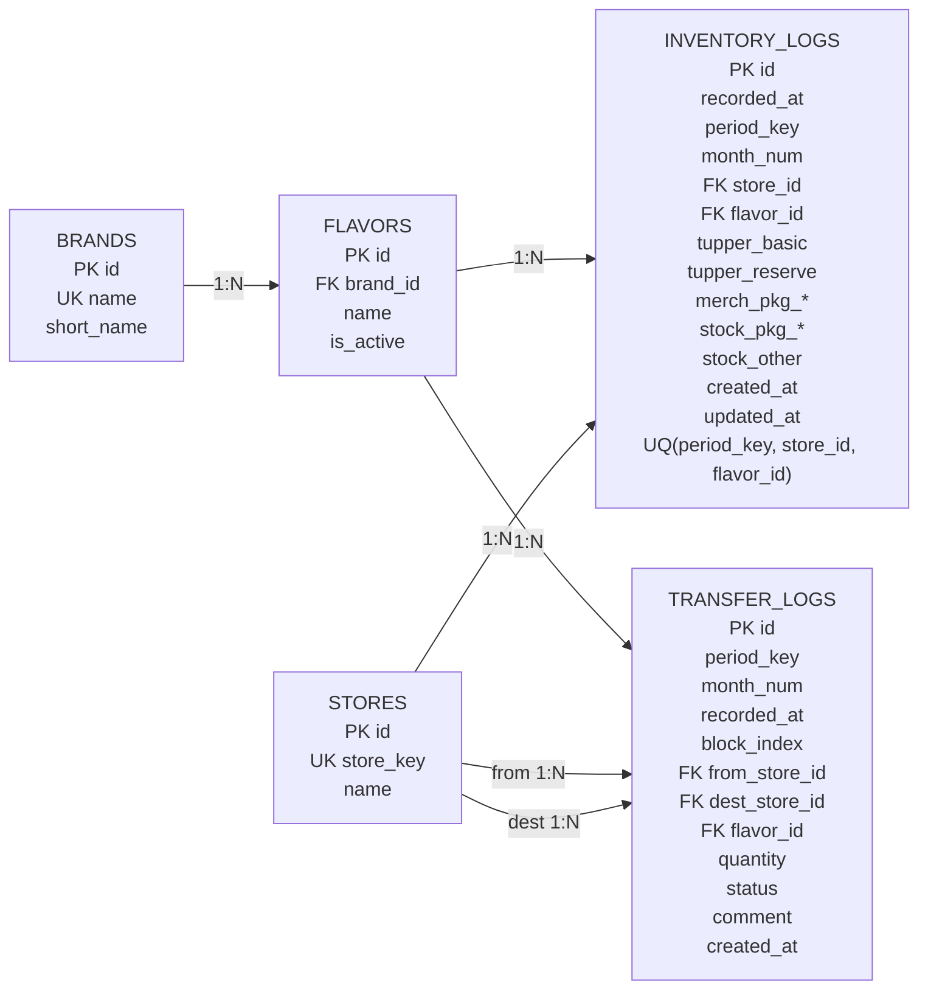

# PROJECT — Supabase ER Diagram

## Summary
- `V-MINT2.0` の Supabase 永続化層の主要テーブルと参照関係をまとめた ER 図。
- 正本は `supabase/schema.sql`。
- Source: [[V-MINT2.0/supabase/schema.sql]]

## Mermaid ER

横長でスクショしやすいよう、`left-to-right` ベースの構成にしている。

## Notes
- `inventory_logs` は `period_key + store_id + flavor_id` を一意キーとして、対象月・店舗・フレーバーの最新棚卸しスナップショットを保持する。
- `transfer_logs` は移動・入荷・廃棄を1テーブルで管理し、`from_store_id` または `dest_store_id` のどちらかが `NULL` になりうる。
  - arrival: `from_store_id is null`
  - dispose: `dest_store_id is null`
  - issue/transfer: 両方あり
- `block_index` は移動記録のまとまりを UI 側で扱うための識別に使う。
- 集計表示は `v_current_stock` と `v_monthly_summary`、および `supabase/rpc.sql` の関数群で構成される。

## Related
- [[PROJECT/notes/PROJECT_architecture]]
- [[PROJECT/notes/PROJECT_release-plan]]
- [[PROJECT/CHANGELOG_DEV]]
