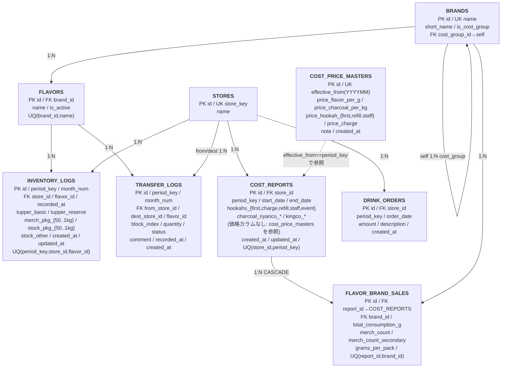

---
tags:
  - project/v-mint2
  - type/note
  - type/diagram
parent:
  - - V-MINT2.0/notes/_index
---

# V-MINT2.0 — Supabase ER Diagram

## Summary
- `V-MINT2.0` の Supabase 永続化層の主要テーブルと参照関係をまとめた ER 図。
- 正本は `supabase/schema.sql` + `supabase/cost_calculation.sql` + `supabase/migrations/`。
- Source: [[V-MINT2.0/supabase/schema.sql]], [[V-MINT2.0/supabase/cost_calculation.sql]]

## テーブル一覧

| テーブル名 | 区分 | 追加タイミング | 説明 |
|---|---|---|---|
| `stores` | マスタ | 初期 | 店舗マスタ |
| `brands` | マスタ | 初期 | ブランドマスタ（原価集約グループ対応） |
| `flavors` | マスタ | 初期 | フレーバーマスタ |
| `inventory_logs` | トランザクション | 初期 | 棚卸しログ |
| `transfer_logs` | トランザクション | 初期 | 移動記録ログ |
| `cost_reports` | トランザクション | 原価計算機能追加 | 月次原価報告テーブル（価格は持たず `cost_price_masters` を参照） |
| `drink_orders` | トランザクション | 原価計算機能追加 | ドリンク発注記録テーブル |
| `flavor_brand_sales` | トランザクション | 原価計算機能追加 | ブランド別消費量・物販数テーブル |
| `cost_price_masters` | マスタ | 単位原価管理機能追加 | 単位原価・販売値の唯一の真実源（価格改定マスタ） |

## Mermaid ER

リーディングビューの横幅を活かすため `top-to-bottom` 3段構成にしている（マスタ → 中間 → トランザクション）。

## テーブル詳細 Notes

### stores / brands / flavors（マスタ系）
- `brands.is_cost_group = TRUE` な行が原価計算用の集約ブランド（例: `Azure Gold/Black`、`Tangiers`）。
- `brands.cost_group_id` が設定された個別ブランドは原価計算モードでは集約ブランドとして扱われる。棚卸し・移動記録では引き続き個別ブランドを使用。
- `flavors.is_active` で棚卸し入力・補充依頼・移動記録での表示/非表示を制御。管理者画面から変更可能。

### inventory_logs（棚卸しログ）
- `period_key + store_id + flavor_id` を一意キーとして、対象月・店舗・フレーバーの最新棚卸しスナップショットを保持する（upsert 方式）。
- `merch_pkg_*` は物販用パッケージ在庫、`stock_pkg_*` は提供用在庫（migration `20260414` で旧 `pkg_*` から分割）。
- `updated_at` は migration `20260416` で追加。

### transfer_logs（移動記録ログ）
- 移動・入荷・廃棄を1テーブルで管理し、`from_store_id` または `dest_store_id` のどちらかが `NULL` になりうる。
  - arrival（入荷）: `from_store_id is null`
  - dispose（廃棄）: `dest_store_id is null`
  - issue/transfer（移動）: 両方あり
- `block_index` は移動記録のまとまりを UI 側で扱うための識別に使う（`GENERATED ALWAYS AS IDENTITY`）。

### cost_reports（月次原価報告）
- 月次原価計算に必要な入力値（シーシャ販売数・炭消費量）を `store_id + period_key` 単位で保存。
- 価格定数は持たない。集計時に `cost_price_masters` を `effective_from <= period_key` で参照する（migration `20260523` で snapshot 廃止）。

### cost_price_masters（単位原価・販売値マスタ）
- 価格改定を `effective_from`（YYYYMM）単位で管理する単一情報源。
- 原価計算・ダッシュボード集計時に `effective_from <= period_key` の最大レコードを動的に選択して適用。
- マスタ編集は過去・未来全月の集計結果に即座に反映される。価格履歴の追跡は `effective_from` と `note` で行う。

### drink_orders（ドリンク発注記録）
- 期中に随時入力するドリンク仕入れ額を記録。`period_key` で集計対象月を紐付ける。

### flavor_brand_sales（ブランド別消費量・物販数）
- `cost_reports` の1明細として、ブランド単位の総消費量（g）と物販個数を保存。
- `merch_count_secondary` は Tangiers のように複数パッケージサイズ（100g / 250g）の物販数を別々に記録するために migration `20260507` で追加。
- `cost_group_id` を持つ個別ブランドは原価計算上は集約ブランドIDで保存される（migration `20260507` でデータ移行済み）。

## Views

| ビュー名 | 説明 |
|---|---|
| `v_current_stock` | 最新棚卸し + 完了済み移動delta の現在在庫ビュー |
| `v_monthly_summary` | 棚卸しログの月次集計（ログ件数・最終記録日） |

## RPC Functions（supabase/rpc.sql）

| 関数名 | 主な引数 | 用途 |
|---|---|---|
| `fetch_transfer_flavors` | `p_period_key` | 移動記録モード用フレーバー一覧＋各店舗在庫 |
| `fetch_request_inventory_data` | `p_period_key` | 補充依頼モード用フレーバー一覧＋各店舗在庫 |
| `fetch_stock_overview` | `p_period_key` | 補充依頼モード用在庫概要（前月消費含む） |
| `fetch_dashboard_stock_overview` | `p_period_key` | ダッシュボード用在庫概要（店舗別内訳付き） |
| `fetch_inventory_result_details` | `p_period_key, p_store_id` | 棚卸し結果詳細（消費量計算含む） |
| `fetch_inventory_sheet_data` | `p_store_id, p_period_key` | 棚卸し入力シートデータ取得 |
| `fetch_all_transfer_records` | `p_period_key` | 移動記録一覧（block単位） |
| `fetch_pending_transfer_records` | `p_period_key, p_dest_store_id` | 未確認（pending）移動記録一覧 |
| `fetch_transfer_record_detail` | `p_period_key, p_block_index, p_store_id` | 移動記録詳細（フレーバー別数量） |
| `fetch_dispose_record_detail` | `p_period_key, p_block_index, p_store_id` | 廃棄記録詳細 |
| `complete_transfer_inspection` | `p_period_key, p_block_index, p_from_store_id, p_dest_store_id, p_items` | 移動受取確認・数量修正 |
| `amend_transfer_record` | `p_period_key, p_block_index, p_items` | 移動記録の事後修正 |

## Migration 履歴

| ファイル | 内容 |
|---|---|
| `20260414_split_merch_stock.sql` | `inventory_logs` の `pkg_*` カラムを `merch_pkg_*` / `stock_pkg_*` に分割 |
| `20260416_inventory_logs_upsert.sql` | `updated_at` カラム追加・重複行削除・一意インデックス作成（upsert対応） |
| `20260507_add_cost_brand_groups.sql` | `brands` に `is_cost_group` / `cost_group_id` を追加、原価集約ブランド行を挿入 |
| `20260507_add_merch_count_secondary.sql` | `flavor_brand_sales` に `merch_count_secondary` を追加（Tangiers 250g対応） |
| `20260512_add_brand_package_flags.sql` | `brands` にパッケージサイズフラグ（`has_pkg_*` / `packages_configured`）を追加 |
| `20260513_add_cost_price_masters.sql` | `cost_price_masters` テーブル新設（価格改定を `effective_from` で管理）、初期レコード投入 |
| `20260514_request_prev_month_consumption.sql` | 補充依頼モードで前月消費量を参照する RPC 更新 |
| `20260517_enable_rls_option_a.sql` | 全テーブルで RLS 有効化（`anon` 全許可ポリシー） |
| `20260523_drop_legacy_price_columns_from_cost_reports.sql` | `cost_reports` の価格6カラムを DROP（snapshot → マスタ参照型への刷新） |

## Related
- [[V-MINT2.0/notes/V-MINT2.0_architecture]]
- [[V-MINT2.0/notes/V-MINT2.0_release-plan]]
- [[V-MINT2.0/CHANGELOG_DEV]]
